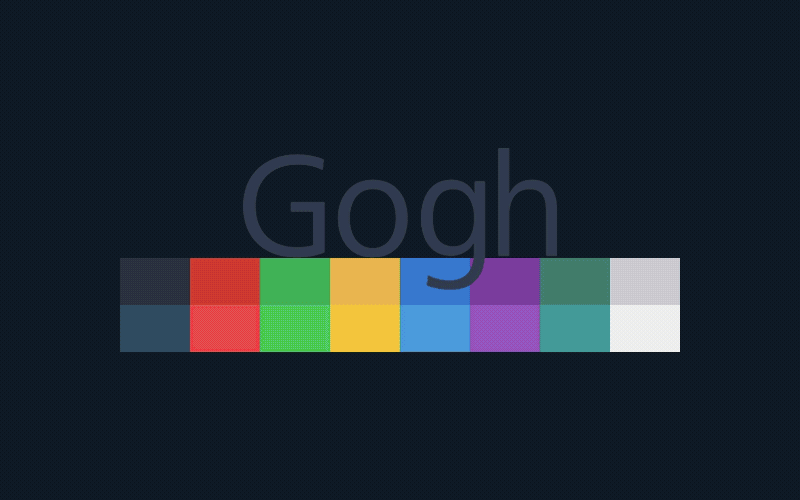

<h1 align="center">
  Gogh
</h1>

<div align="center">
  
</div>

<br>

<div align="center">
🔸🔸🔸 <a href="http://Gogh-Co.github.io/Gogh"> gogh.website </a> 🔸🔸🔸
</div>

## Color Scheme Implementer for Terminals

Gogh is a collection of color schemes for various terminal emulators, including Gnome Terminal, Pantheon Terminal, Tilix, and XFCE4 Terminal. These schemes are designed to make your terminal more visually appealing and improve your productivity by providing a better contrast and color differentiation.

The inspiration for Gogh came from the clean and minimalistic design of Elementary OS, but the project has since grown to include a variety of unique and beautiful options. Not only does Gogh work on Linux systems, but it's also compatible with iTerm on macOS, providing a consistent and visually appealing experience across platforms.

##### Run:

```bash
bash -c "$(curl -fsSL https://gogh.website/gogh)"
```

<br>

<div align="center">
This project is here for anyone to use, no expectations. <br>
If you want to buy me a coffee voluntarily, you can use this link.

[](https://paypal.me/mgldvd?country.x=CO&locale.x=es_XC)

</div>

<table>
<tr>
<td>


<b style="font-size:30px">Index:</b>

<br>

- [Pre-Install](https://github.com/Gogh-Co/Gogh?tab=readme-ov-file#%EF%B8%8F-pre-install)
- **[Install](https://github.com/Gogh-Co/Gogh?tab=readme-ov-file#-install)**
- [Install (Non-Interactive mode)](https://github.com/Gogh-Co/Gogh?tab=readme-ov-file#%EF%B8%8F-install-non-interactive-mode)
- [Terminal Support](https://github.com/Gogh-Co/Gogh?tab=readme-ov-file#-terminals)
- [Available Themes](https://github.com/Gogh-Co/Gogh?tab=readme-ov-file#-themes)
- [Help](https://github.com/Gogh-Co/Gogh?tab=readme-ov-file#-help)
- [Create your Own Theme!](docs/CONTRIBUTING.md)
- [Accessibility ~ WCAG](https://github.com/Gogh-Co/Gogh?tab=readme-ov-file#-accessibility---wcag)
- [First commit](https://github.com/Gogh-Co/Gogh?tab=readme-ov-file#-first-commit)
- [Credits](https://github.com/Gogh-Co/Gogh?tab=readme-ov-file#heart-credits)
- [Contributors](https://github.com/Gogh-Co/Gogh?tab=readme-ov-file#heart-contributors)
- [Author](https://github.com/Gogh-Co/Gogh?tab=readme-ov-file#-author-contributor)
- [Why Gogh?](https://github.com/Gogh-Co/Gogh?tab=readme-ov-file#%EF%B8%8F-why-gogh)
- [Mentions](https://github.com/Gogh-Co/Gogh?tab=readme-ov-file#-mentions)
- [Work with Agents](https://github.com/Gogh-Co/Gogh?tab=readme-ov-file#-work-with-agents)
- [License](https://github.com/Gogh-Co/Gogh?tab=readme-ov-file#-license)
- [*Stargazers Over Time*](https://github.com/Gogh-Co/Gogh?tab=readme-ov-file#-stargazers-over-time)

</td>
<td>

<br>
<br>


</td>
</table>

<br>

## ⚙️ Pre-Install

In your terminal, type:

For **Debian/Ubuntu:**

```bash
sudo apt-get install dconf-cli uuid-runtime
```

For **Arch Linux:**

```bash
sudo pacman -S dconf util-linux-libs
```

You can now install Gogh in Interactive Mode (Easier) or Non-Interactive Mode! (Ideal for Scripting)

<br>
<br>

## **Install**

### Interactive Mode:

**1. Just copy and paste this one-line command:**

```bash
bash -c "$(wget -qO- https://gogh.website/gogh)"
```

Or, if you're a Mac user:

```bash
bash -c "$(curl -fsSL https://gogh.website/gogh)"
```

> **Using Fish or NuShell?** The `$(...)` command substitution above isn't valid syntax in those shells. Wrap the whole thing in an extra `bash -c` instead:
>
> ```bash
> bash -c 'bash -c "$(wget -qO- https://gogh.website/gogh)"'
> ```

**2. Select your installed theme from your terminal.**

**DEMO:**


<br/>

### CLI Arguments (skip the interactive menu)

Select themes directly by name/slug instead of the interactive list:

```bash
./gogh.sh Dracula
./gogh.sh dracula nord-light

# all themes
./gogh.sh ALL
```

For one-line remote usage with arguments, pass `--` before the options:

```bash
bash -c "$(wget -qO- https://gogh.website/gogh)" -- Dracula
```

<br/>
<br/>

## ⚙️ Install (Non-Interactive Mode)

Two ways:

* Clone the repository.
* Download the only required files. (Bare Minimum!)

### Clone Repository

```bash
# Clone the repo into "$HOME/src/gogh"
mkdir -p "$HOME/src"
cd "$HOME/src"
git clone https://github.com/Gogh-Co/Gogh.git gogh
cd gogh

# necessary in the Gnome terminal on ubuntu
export TERMINAL=gnome-terminal

# necessary in the Alacritty terminal
pip install -r requirements.txt
export TERMINAL=alacritty

# Enter theme installs dir
cd installs

# install themes
./atom.sh
./dracula.sh
```

### Download the only required files. (Bare Minimum!)

```bash
# Download apply script
wget https://github.com/Gogh-Co/Gogh/raw/master/apply-colors.sh
# Download desired themes from ./installs/ like this:
wget https://github.com/Gogh-Co/Gogh/raw/master/installs/selenized-dark.sh

# Optional - download Alacritty dependency (may require additional python packages, see requirements.txt for more)
wget https://github.com/Gogh-Co/Gogh/raw/master/apply-alacritty.py
# Optional - download Terminator dependency (may require additional python packages, see requirements.txt for more)
wget https://github.com/Gogh-Co/Gogh/raw/master/apply-terminator.py

# You can also specify where to find the apply scripts with the following environmental variables:
GOGH_APPLY_SCRIPT=/path/to/apply-colors.sh
GOGH_ALACRITTY_SCRIPT=/path/to/apply-alacritty.py   # only needed if applying to Alacritty terminal
GOGH_TERMINATOR_SCRIPT=/path/to/apply-terminator.py # only needed if applying to Terminator terminal

# Control Gogh behavior with the following:
TERMINAL=gnome-terminal # Select for which terminal to install the theme
                        # (see apply-colors.sh for all supported terminals)
GOGH_NONINTERACTIVE= # Make output silent and answer all prompts with default value
                     # (errors will still be printed)
GOGH_USE_NEW_THEME= # Make theme the currently used/default one of the terminal
                    # Actual effect may differ between terminals
                    # Supported terminals: xfce4-terminal

# Apply downloaded theme (apply script must be in the same folder)
TERMINAL=gnome-terminal bash ./selenized-dark.sh
# OR specify apply script path
GOGH_APPLY_SCRIPT=/path/to/file/apply-colors.sh bash ./selenized-dark.sh
```

<br/>
<br/>

## 💻 Terminal Support

Here are some terminals that Gogh is supported with:

- Alacritty - [Web](https://github.com/alacritty/alacritty)
- Cygwin - [Web](https://www.cygwin.com/)
- Foot - [Web](https://codeberg.org/dnkl/foot)
- Ghostty - [Web](https://ghostty.org/)
- Gnome - [Web](https://help.gnome.org/users/gnome-terminal/stable/)
- Guake - [Web](http://guake-project.org/)
- iTerm - [Web](https://iterm2.com/)
- Kitty - [Web](https://sw.kovidgoyal.net/kitty/)
- kmscon - [Web](https://github.com/dvdhrm/kmscon)
- Konsole - [Web](https://konsole.kde.org/)
- linux (Linux virtual terminal) - [Web](https://man7.org/linux/man-pages/man4/console.4.html)
- Mate - [Web](https://github.com/mate-desktop/mate-terminal)
- Mintty - [Web](https://mintty.github.io/)
- Pantheon / Elementary - [Web](https://github.com/elementary/terminal)
- st+ - [Web](https://github.com/vishnu350/st)
- Termux - [Web](https://termux.dev/)
- Tilix - [Web](https://gnunn1.github.io/tilix-web/)
- Wezterm - [Web](https://wezterm.org/)
- XFCE4 - [Web](https://docs.xfce.org/apps/terminal/start)
- Terminator - [Web](https://github.com/gnome-terminator/terminator)

Don't see your terminal on this list? [Open a terminal support request](https://github.com/Gogh-Co/Gogh/issues/new?template=terminal-support.yml).

<br/>
<br/>

## 🎨 [Themes](https://Gogh-Co.github.io/Gogh/)

We have lots of themes in stock! Check them out [here](https://Gogh-Co.github.io/Gogh/)!

- **json**: https://raw.githubusercontent.com/Gogh-Co/Gogh/master/data/themes.json
- **json min**: https://raw.githubusercontent.com/Gogh-Co/Gogh/master/data/themes-min.json

<br/>

- **csv**: https://raw.githubusercontent.com/Gogh-Co/Gogh/master/data/themes.csv

<br/>

### 🔑 Color Hash

Every theme in `themes.json` carries two SHA-256 fields, so palette and background can be compared independently:

- `hash` — the theme's **16 ANSI colors only**, independent of `name`, `author`, `variant`, `background`, `foreground`, or `cursor` (those are cosmetic).
- `hash_bg` — the theme's `background` value only.

**How they're computed** (`tools/lib/theme_common.py`, used by `tools/generate/01_generate_themes_json.py`):

- `hash`: concatenate `color_01` → `color_16` hex values as-is, no separators, then SHA-256 the result.
- `hash_bg`: SHA-256 of the `background` hex value on its own.

Example — `Solarized Dark.yml`:

```
#002831#D11C24#738A05#A57706#2176C7#C61C6F#259286#EAE3CB#001E27#BD3613#475B62#536870#708284#5956BA#819090#FCF4DC
↓ SHA-256 → hash
56c19575cf17b9adb71130dbf58b45d36ef250ace147115edfe61b126166f489

#001E27
↓ SHA-256 → hash_bg
70c870089f3b222d01ae3f98d86dc53e11cb7f4cde69ecfe1f1a90a541811b2e
```

`hash` only changes if one of the 16 palette colors changes — background/cursor/foreground and metadata edits don't touch it. `hash_bg` only changes if the background changes. Two themes sharing both hashes are true duplicates; sharing only `hash` means same palette, different background.

<br/>

## 👀 [WCAG](https://Gogh-Co.github.io/Gogh/wcag) - Accessibility Contrast

- **Web**: https://gogh-co.github.io/Gogh/wcag

<br/>

- **wcag**: https://raw.githubusercontent.com/Gogh-Co/Gogh/master/data/wcag.json
- **wcag min**: https://raw.githubusercontent.com/Gogh-Co/Gogh/master/data/wcag-min.json

<br/>

- More information: https://webaim.org/resources/contrastchecker/

<br/>
<br>

## ❓ HELP

See [docs/ISSUE_POLICY.md](docs/ISSUE_POLICY.md) for how issues are triaged and when they're closed.

- [Ubuntu 19.10: default_profile not a valid identifier, command not found](https://github.com/Gogh-Co/Gogh/issues/203)
- [Using Elementary terminal but says unsupported](https://github.com/Gogh-Co/Gogh/issues/175)
- [Doesn't working Debian](https://github.com/Gogh-Co/Gogh/issues/63)
- [Not Working on Ubuntu](https://github.com/Gogh-Co/Gogh/issues/41)
- `sudo apt install gconf2` - https://github.com/Gogh-Co/Gogh/issues/334#issuecomment-1374541799

### 🔹 Debian Fixes

#### [Fix 1](https://github.com/Gogh-Co/Gogh/issues/63#issuecomment-361071956) (@romzie):

- Reset your profiles:

```bash
dconf reset -f /org/gnome/terminal/legacy/profiles:/
```

#### [Fix 2](https://github.com/Gogh-Co/Gogh/issues/63#issuecomment-401224491) (@MalwareJedi):

- Reset your profiles:

```bash
dconf reset -f /org/gnome/terminal/legacy/profiles:/
```

- Close your terminal; re-open it.
- Go to **Edit** ---> **Preferences** ---> **Profiles**.
- Create a **new** profile called **Default**.
- Close the terminal. re-open it.
- Confirm that **Default** is still listed in your profiles.
- If it is, run the Gogh script again.

#### [Fix 3](https://github.com/Gogh-Co/Gogh/issues/63#issuecomment-401510226) (@sui74):

- Reset your profiles:

```bash
dconf reset -f /org/gnome/terminal/legacy/profiles:/
```

- "Unname" Rename profile called "default".

```bash
sudo apt install uuid-runtime
```

- Run the Gogh script.

### 🔹 Elementary OS

1 - Uncomment the following line in `.bashrc` ;you can find this file in your `/home/USER/` directory.

```bash
    #force_color_prompt=yes
```

2 - Execute in terminal

```bash
source .bashrc
```

### 🔹 Arch Linux

**[#297](https://github.com/Gogh-Co/Gogh/issues/297):** `dconf-cli` and `uuid-runtime` don't exist under those names on Arch.

```bash
sudo pacman -S --needed dconf util-linux gnome-terminal
```

`dconf` provides the dconf backend, `util-linux` provides `uuidgen` (Arch's equivalent of `uuid-runtime`). If `gsettings get org.gnome.Terminal.ProfilesList default` still errors after installing, log out/in (or reboot) to refresh the D-Bus session, then re-run Gogh.

### 🔹 Termux

**[#252](https://github.com/Gogh-Co/Gogh/issues/252):** Termux doesn't use dconf, so Gogh's terminal detection doesn't apply — set colors manually instead.

```bash
mkdir -p ~/.termux
nano ~/.termux/colors.properties
```

Paste your chosen theme's palette (`background`, `foreground`, `cursor`, `color0`–`color15`) from its `.yml` file in [`themes/`](themes/), then apply:

```bash
termux-reload-settings
```

If you use *Termux:Styling*, you can manage colors from its UI instead.

### 🔹 Ubuntu 19.10

**[#203](https://github.com/Gogh-Co/Gogh/issues/203), [#260](https://github.com/Gogh-Co/Gogh/issues/260):** `default_profile: not a valid identifier` / command not found — usually a missing "Default" profile or missing dependencies.

```bash
sudo apt update
sudo apt install -y dconf-cli uuid-runtime gnome-terminal
```

Create or rename your GNOME Terminal profile to **Default**, then re-run Gogh. Verify with:

```bash
gsettings get org.gnome.Terminal.ProfilesList list
gsettings get org.gnome.Terminal.ProfilesList default
```

### 🔹 Fedora 40

**[#466](https://github.com/Gogh-Co/Gogh/issues/466):** GNOME Terminal on Fedora 40 needs `GConf2`, which isn't installed by default.

```bash
sudo dnf install -y GConf2 gnome-terminal
```

Re-run Gogh and confirm the theme applies in a new terminal session.

<br>
<br>

## 🖼️ Create your Own Theme!

See [`CONTRIBUTING.md`](docs/CONTRIBUTING.md) — the single source of truth for
adding a theme: the `.yml` template, the field-by-field reference, the
rules a theme PR needs to follow, and how to check it locally with
`task validate` before opening the PR.

<br>

## 🤖 Work with Agents

`master` does not track agent-context files — `AGENTS.md` and the `memory/` folder
(architecture decisions + current project status) live on a dedicated orphan branch,
`meta/agents-master`, so the project's own history stays focused on Gogh itself.

If you want to work on this repo with an AI coding agent, bring those files into your
working copy:

```bash
git restore --source meta/agents-master -- AGENTS.md
git restore --source meta/agents-master -- memory/
```

That gives you:

- `AGENTS.md` — the entry-point pointer any agent should read first.
- `memory/STATUS.md` — the real, current state of the project (what's in progress,
  what's uncommitted).
- `memory/decisions/` — Architecture Decision Records (ADRs) for choices already made,
  with their rationale, so an agent doesn't re-propose something already settled.

**Note:** tool-specific folders such as `.agents/` and `.claude/` (agent *skills*) are
intentionally left out of this — there isn't an established, tool-agnostic standard
yet for how skills should be structured or shared, so for now they stay local/
untracked rather than committed to either branch.

<br/>

## 🌱 First commit:

Nov 18, 2013 - [aa9871e](https://github.com/Gogh-Co/Gogh/commit/aa9871e2d6008d5dc8986b90356fa7cf433a0bb3)

<br/>

## :heart: Credits:

The full theme-by-theme author list now lives in [CREDITS.md](docs/CREDITS.md).

<br/>

## :heart: Contributors:

Many thanks to all who have participated in this project.

[@contributors](https://github.com/Gogh-Co/Gogh/graphs/contributors)

<a href="https://github.com/Gogh-Co/Gogh/graphs/contributors">
  
</a>

<br/>
<br/>

## 🧠 Author (contributor)

I cannot claim to be the only author of this project. Without the help of the people who have contributed, this would not have been possible. Therefore, that's why all contributors are listed first in this document. While I am listed as the author, the true authors are all those who are mentioned in the document. I would like to express my gratitude to all of them, as well as to future contributors.

- Miguel D. Quintero - [Lanet.co](https://lanet.co)

<div align="center">

[](https://x.com/Mgldvd_tech)
[](https://github.com/Mgldvd)

</div>

<div align="center">
This project is here for anyone to use, no expectations. <br>
If you want to buy me a coffee voluntarily, you can use this link.

[](https://paypal.me/mgldvd?country.x=CO&locale.x=es_XC)

</div>

<br/>
<br/>

## 🖌️ Why Gogh?

There is no blue without yellow and without orange.

-- [Vincent Van Gogh](https://en.wikipedia.org/wiki/Vincent_van_Gogh) --

<br/>
<br/>

## 📣 Mentions

The full list of blogs, forums, videos and comparison sites that have mentioned Gogh now lives in [MENTIONS.md](docs/MENTIONS.md).

<br/>

## 📜 License

Gogh is dual-licensed under either the [MIT license](LICENSE-MIT) or the
[Apache License, Version 2.0](LICENSE-APACHE), at your option.

<br/>

## 🌟 Star History

[](https://www.star-history.com/?repos=Gogh-Co%2FGogh&type=date&legend=bottom-right)

[](https://www.star-history.com/gogh-co/gogh)